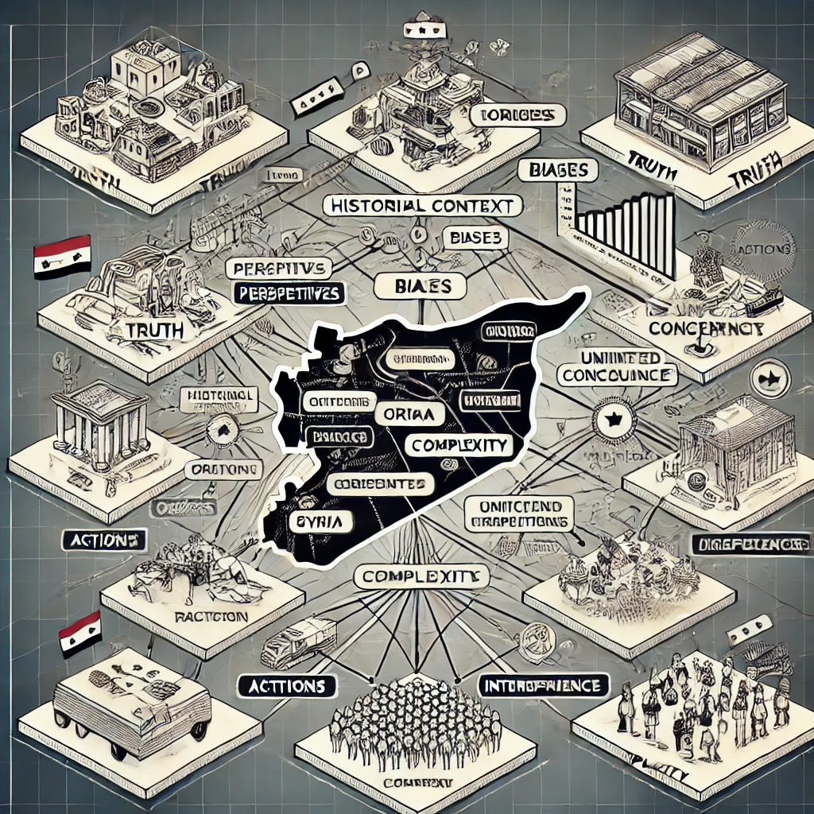

# Project RootSource

Welcome to **Project RootSource**, a step-by-step framework for understanding and analyzing misinformation during complex events.  

This repository is the beginning of an experiment – one that aims to uncover patterns, roots, and the truth behind misinformation.  

### Current Progress
Stay tuned as this project evolves.  
Follow updates and participate in the discussion!

---

## Syria Complexity Framework

This visualization demonstrates the limitations of using a single model to analyze complex events, such as the Syria conflict.  
It highlights the three critical layers of the analysis:  

1. **Truth**: Perspectives, biases, and narratives.  
2. **Origin**: Historical context and unintended consequences.  
3. **Complexity**: Actions, reactions, and interdependencies.

This image serves as a foundation for building layered models to better understand and analyze interconnected events.  
Follow the progress and framework development: [Project RootSource Repository](https://github.com/dein-account/ProjectRootSource)
